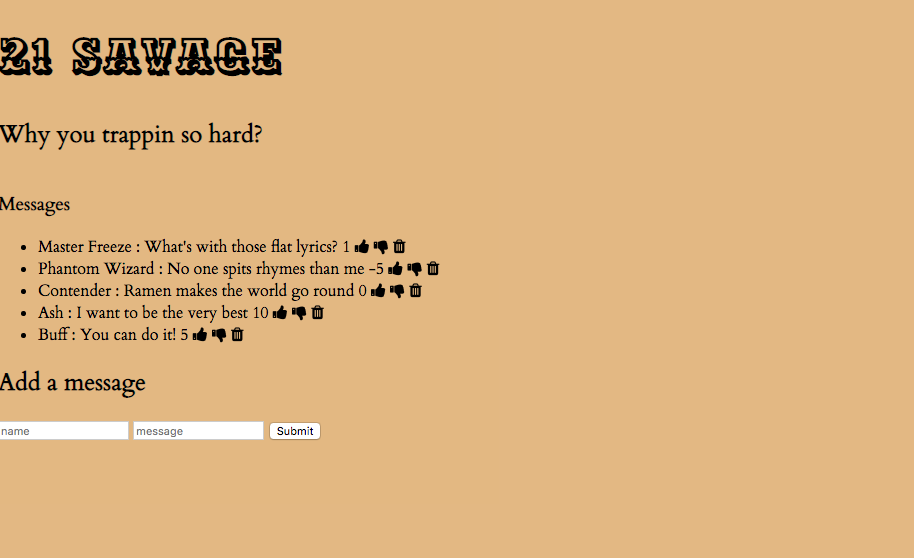

# Savage 21 Fan Page
A web application with CRUD functionality that allows users to post messages about the savage 21 rapper. You are able to create, read, update, and delete messages on this fan page.

## Usage

1. run `npm run savage`
2. Navigate to `localhost:3000`

## How It's Made:

**Tech used:** HTML, CSS, JavaScript

The project focused on creating client side, server side JavaScript, and an EJS file to render the html page.

## Optimizations

Styling can be enhanced for future projects.

## Lessons Learned:

I learned that this project has all the basic CRUD functionality API endpoints finished and works after repeated trial and error.
